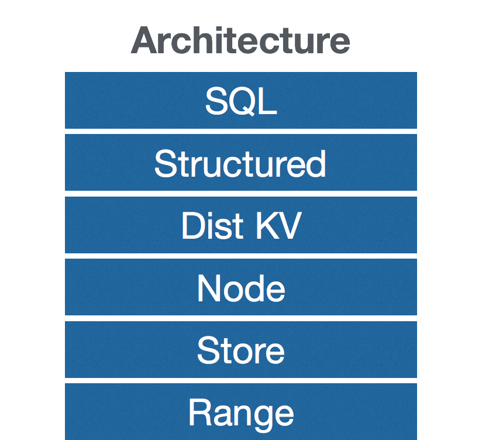

# Cockroach

## A Scalable, Available, Transactional Database


---

# Why

--

## History (at Google)

* &lt;2004: SQL (sharding, ...)
* 2004: NoSQL (BigTable)
* 2006: (New-ish SQL) Megastore *on top of BigTable*
  * transactional (but slow and complex)
* 2012: Spanner (NewSQL)
  * fully linearizable (hence consistent)

--

>“We believe it is better to have application programmers deal with performance problems due to overuse of transactions as bottlenecks arise, rather than always coding around the lack of transactions.”

Corbett et al., Spanner paper, 2012

--

## Google Spanner

is basically what you would get if SQL and NoSQL had a designer baby that combined
both their advantages:

- scalable,
- highly available,
- transactional.

--

## but...

* only Google can have it
* hardware: atomic clocks, GPS receivers
* inhomogeneous infrastructure: TrueTime API, Chubby, Collossus, ...

--

## We want you

* to have something like Spanner
  * platform semirelational database
  * fault-tolerant, transactional, scalable, fast (enough)
* but simpler than Spanner
  * time signal not central to design - no hardware req'd
  * non-locking distributed transactions
  * simple homogenous infrastructure
* and OpenSource
  * this stuff is hard - trust nobody
  * see: [Jepsen series](https://github.com/aphyr/jepsen)

---

# How?

--

* primarily a **sorted monolithic key-value store**
* written in [Go](http://golang.org)
* [RocksDB](http://rocksdb.org) for **storage**
* [Raft](https://raftconsensus.github.io/) for **consensus & replication**
* [Hybrid Logical Clock](http://muratbuffalo.blogspot.de/2014/07/hybrid-logical-clocks.html) for **causality**
* (own) non-locking distributed **transactions**

--



--

## Distributed Transactions
* variation of two phase commit
* txn writes stored as MVCC “intents”
* central transaction table:
  * single key/txn: status, timestamp, priority, ...
  * the single source of truth, atomically updated by txns
* commit: single write to transaction table entry
* intents resolved after commit - correctness doesn't need it!

--

```go
c.RunTransaction(&opts, func(txn *client.KV) error {
  gr := proto.GetResponse{}
  // create key in txn table: ("txn1", "pending")
  // reads key1 as txn1, assume the value is "test"
  txn.Call(proto.Get,
           proto.GetArgs(proto.Key("key1")), &gr)
  // writes ("intent(txn1)", "test-new") to key2
  txn.Call(proto.Put,
           proto.PutArgs(proto.Key("key2"),
             append(gr.Value.Bytes, []byte("-new"))),
           &proto.PutResponse{})
  return nil
  // reads "txn1": still finds "pending" (good!)
  // writes ("txn1", "committed")
})
// writes ("value", "test-new") to key2 (resolve intent)
```

---

# Who?

--

* most early core members ex-Googlers and based in NYC
* notably [Spencer Kimball](https://github.com/spencerkimball), author of original design documents and majority of the code
* Andy Kimball, Andrew Bonventre, Shawn Morel, Peter Mattis, Ben Darnell, Harshit Chopra, Levon Lloyd, Manik Surtani, Tobias Schottdorf, Matt Tracy, Zach Brock, Matthew O'Connor, Tyler Neely, Brad Seiler, Joy Tao, Jiajia Han, jqmp, jiangmingyang, Kathy Spradlin, Piotr Zurek, strangemonad, Bram Gruneir, Paul Banks, James Graves, joezxy, Nick Gottlieb
* ... and perhaps you? Lots to do, and it's fun

---

# Thank you

* https://github.com/cockroachdb/cockroach
* design docs: http://goo.gl/0pTVNM
* Open Source (duh) - Apache licensed
* [cockroach-db@googlegroups.com](mailto:cockroach-db@googlegroups.com)
* beta coming soon!
